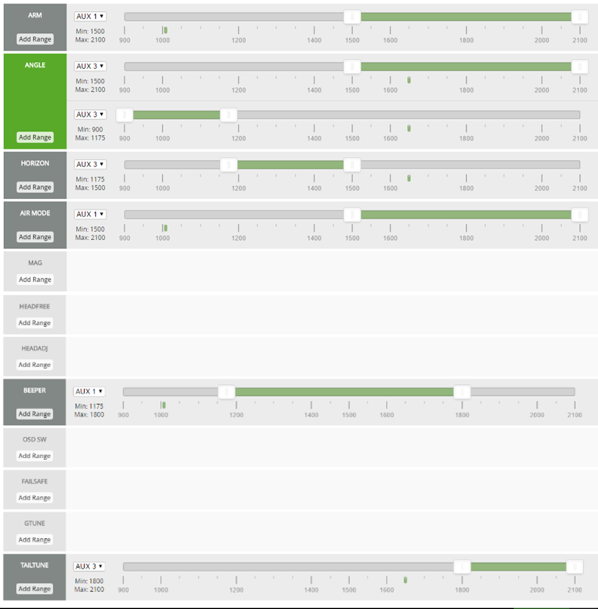

#Transmitter setup for DX6i with 4 mode switches

With this setup you will get four mode switches, which is not bad for a 6ch radio.

This is written for the NAZE board and a PWM receiver using AUX3 (pin RC7) instead of AUX2 since the pin RC6 is used for the tricopter tail servo feedback.
With a serial receiver you shall use AUX2.
Note that you may have to adjust some mode values a little if your receiver output is different.
You make your own choices when you understand what is going on here.
Stay away from Arm until you know what you are doing.
Suggest you select Motor Stop and have props off while doing this.

###Step by step

Make a model reset so everything is at default values. Chose Model type Acro and give it a suitable model name.

In page Flaps; Set Flap value for Norm to Up 100 and Land to Down 100.

In page Mix 1; Set Act; Set Flap -> Flap; Set both Rate D and U to -70%; Chose SW to Ele D/R.

In page Mix 2; Set Act; Set Gear -> Gear; Set both Rate D and U to -70%; Chose SW to Mix.

Connect flight battery. Perform the bind process for your receiver. Connect Cleanflight Configurator and look at Radio page.

Select channel map for Spectrum, TAER1234, and save.

In Transmitter page Reverse; select R for any channel that moves the wrong way in the Configurator Radio page. The values should increase when moving the stick up/right. I had to reverse aileron and rudder.

In Transmitter page Travel Adjust; adjust each field at both full stick positions so the Configurator gets min values close to but not below 1000 and max values close to but not above 2000.
Only move one stick and only in one axis at a time so you don't give a stick command by mistake (such as Arm).

In page Sub Trims; adjust if necessary so each channel mid is 1500.

The two steps may influence each other so repeat until both are good.

### Configurator Modes page

Select one function for AUX1 and another for AUX3.
Play around with the switches Gear, Elev D/R, Flap and Mix and see how the values change.
I have found that 1175, 1500 and 1800 are good range limits with good separation to all possible values.

For starters, say I want to control the following functions:
- Angle/Horizon
- Tail Tune On/Off
- Beeper On/Off
- Arm (and Air Mode) On/Off
I also want all switches to have 0 as the off, or the safest, position.
It will make the take-off procedure easy to remember.

#### Set it up

- Angle: AUX3 1500 - 2100, Add Range: AUX3 900 - 1175
- Horizon: AUX3 1175 - 1500

These means it will use Horizon when Elev D/R switch is on, and Angle otherwise.

- Tail tune: AUX3 1800 - 2100

This means it will use the Tail tune mode when the Flap switch is on and the Elev D/R switch is off.
Angle mode is fine for tail tune.

- Beeper: AUX1 1175 - 1800

So beeper will sound when the Mix switch is on (and the Gear switch can be in any position).

- Arm: AUX1 1500 - 2100

So it is armed when the Gear switch is on (and the Mix switch can be in any position).

- Air Mode: Same setting as Arm.

Save and then try every combination for these four switches and check in the Configurator that the modes turn on (green) and off (dark grey) as you expect.

### How it looks

### Alternatives

If you want, you can do
- Angle: off
- Horizon: AUX3 1500 - 2100, Add Range: AUX3 900 - 1175

This means it will use default mode (= rate = acro) when the Elev D/R switch is on, and Horizon otherwise. 

The choice of Gear switch for Arm is maybe not perfect for the nervous new pilot. It is close to the Elev D/R switch and turning Arm off by mistake while flying is really not a good thing. You can figure out something different if you want.

